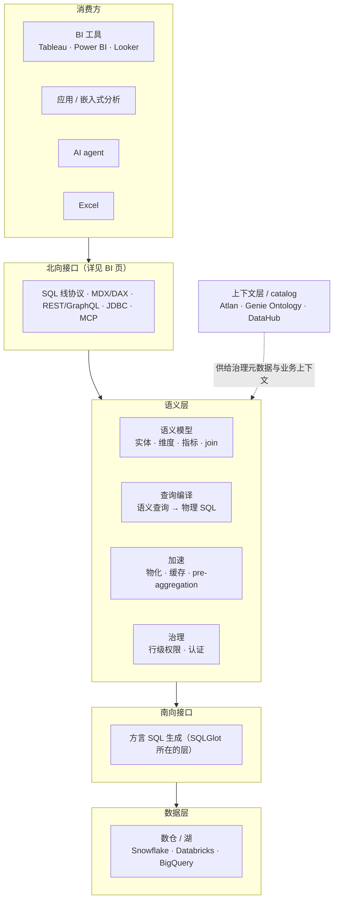

# Semantic Layer

## 定义

位于物理数据（数仓、湖、各类源）与消费方（BI、应用、AI agent）之间的翻译层：把技术结构（表、字段、join）映射为业务概念（实体、维度、指标），业务逻辑一次定义、处处复用。

## 架构位置

读这张图的三把钥匙：

- **语义层是编译器不是数据库**：它不存数据，存的是"业务概念 → 物理结构"的映射，每次查询时把语义请求编译成方言 SQL（机制见 [[BI]] 页"语义查询的编译旅程"）。
- **北向接口的宽度决定消费方范围，南向方言的宽度决定数据源范围**——厂商的"通用性"宣称都可以拆成这两头验证。
- **上下文层/catalog 是供给方不是消费方**：它把血缘、ownership、业务术语喂给语义层（或直接喂给 agent），自身不执行查询——这是 [[Context Layer]] 与语义层的真实边界。

## 为什么重要

- 解决指标口径不一致（"三个系统三个 revenue"）的老问题。
- 2024 年后新增的核心动因：作为 LLM/agent 的 grounding 层。LLM 对裸 schema 写 SQL 准确率约 40%，grounding 在治理语义定义上可达 83%+（dbt 内部测试口径，业界广泛引用）。
- 2026 年语义碎片化成为新问题：每家大厂各有一套语义层，[[Open Semantic Interchange]] 是行业回应。

## 关键设计维度

- 语义模型的表达方式：YAML / DSL / SQL 扩展 / 可视化建模（见 [[Semantic Model]]）
- 部署位置：平台原生 vs 独立中间层 vs BI 内嵌（见 [[Semantic Layer Vendor Landscape]] 的阵营划分）
- 查询路径：编译改写（见 [[Query Rewrite]]）与加速（见 [[Query Acceleration]]）
- 消费接口：SQL / REST / GraphQL / MCP（见 [[Headless BI]]）
- 与治理体系的关系（见 [[Data Governance]]、[[Data Catalog]]、[[Context Layer]]）

## 相关概念

[[Metrics Layer]]（语义层最常见的落地形态）、[[Semantic Model]]、[[Context Layer]]（Atlan 主张的超集概念）、[[Headless BI]]
